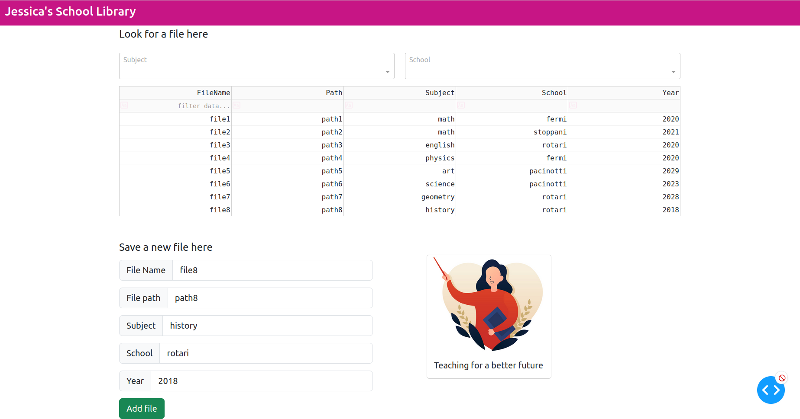

In this repository a personal library is implemented. The project is intended to be used by a teacher or similar. In more details the user is able to:
1. Insert files specifying the name of the file, the path, the subject, the school and the year
2. Get the name and the path of the files using filters on the subject, the school or both
3. Modify the path of a file
4. Use the dashboard interface to save and retrieve files

